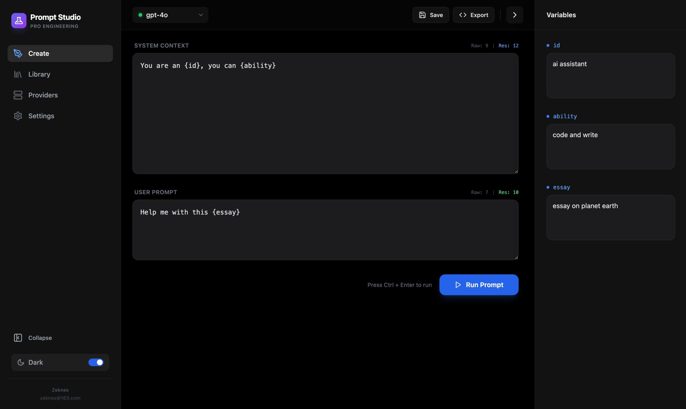
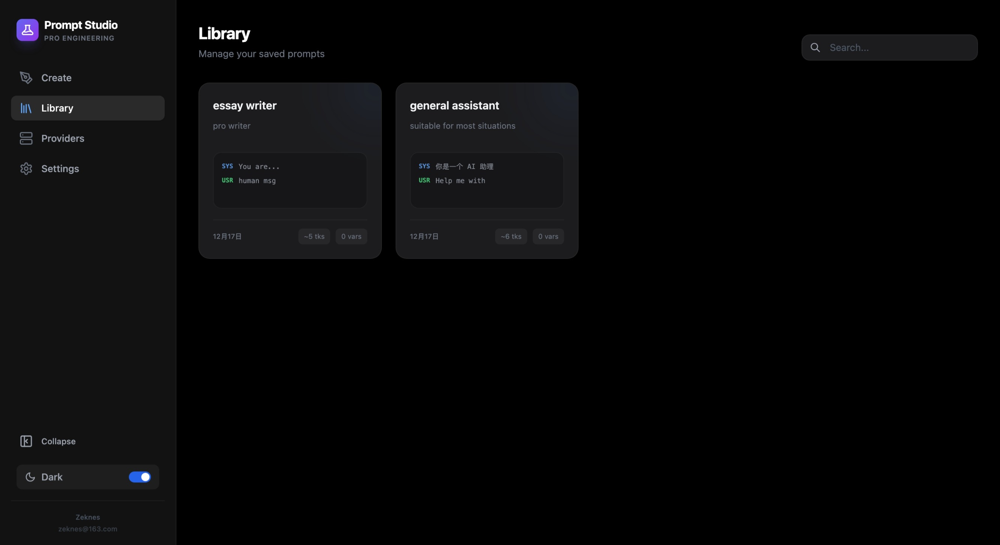
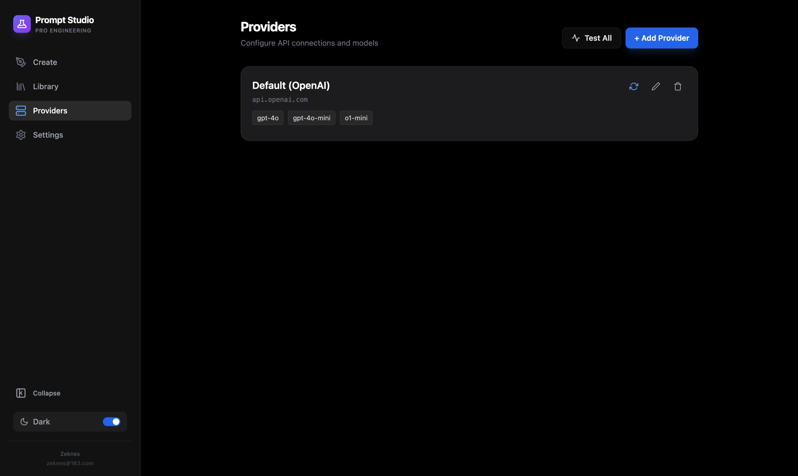
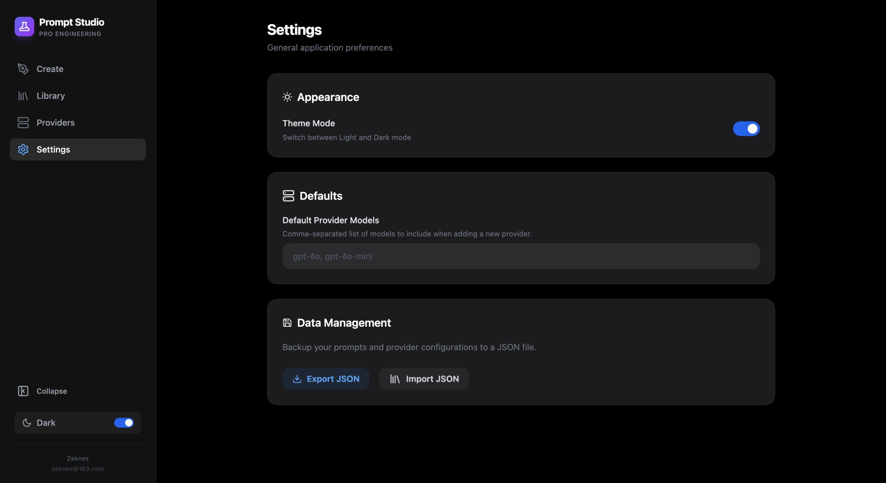

# Prompt Studio 🚀

### [🔗 Live Demo / 在线体验](https://Zeknes.github.io/Prompt-Studio/)

**The Ultimate LLM Prompt Engineering & Debugging Tool.**  
**终极 LLM 提示词工程与调试工具。**



Prompt Studio is a powerful, local-first integrated development environment (IDE) designed for Prompt Engineers and Developers. It streamlines the process of crafting, testing, and managing prompts for Large Language Models (LLMs), ensuring your data remains private and secure.

Prompt Studio 是一款专为提示词工程师和开发者打造的强大、本地优先的集成开发环境 (IDE)。它简化了为大语言模型 (LLM) 编写、测试和管理提示词的流程，并确保您的数据私密且安全。

---

## ✨ Key Features (核心功能)

### 🔒 Privacy First (隐私优先)
**Data Security via Local Browser Storage.**  
All your prompts, settings, and API keys are stored exclusively in your local browser's storage (IndexedDB/LocalStorage). No data is ever sent to our servers. You have complete control over your sensitive information.

**Safe to Use Online.**  
Even when accessing Prompt Studio via a web URL (e.g., GitHub Pages), the application runs entirely client-side. Your data never leaves your device. It is just as safe as running it locally.

**数据安全保存在本地浏览器。**  
您的所有提示词、设置和 API 密钥都仅存储在您的本地浏览器存储（IndexedDB/LocalStorage）中。没有任何数据会被发送到我们的服务器。您对您的敏感信息拥有完全的控制权。

**在线访问同样安全。**  
即使通过网页链接（例如 GitHub Pages）访问 Prompt Studio，应用也完全在客户端（浏览器）运行。您的数据永远不会离开您的设备。这与在本地运行一样安全。

### 🛠️ Ultimate Debugging (终极调试)
**Iterate and Optimize with Ease.**  
Test your prompts against multiple LLM providers instantly. Compare outputs, tweak parameters, and refine your prompt engineering workflow in a dedicated, distraction-free environment.

**轻松迭代与优化。**  
即时在多个 LLM 提供商之间测试您的提示词。比较输出、调整参数，并在一个专注、无干扰的环境中完善您的提示词工程工作流。

### 📚 Prompt Library (提示词库)
**Organize and Reuse.**  
Build a personal library of effective prompts. Tag, search, and version your best ideas so you never lose a winning prompt again.

**组织与复用。**  
建立个人高效提示词库。对您的最佳创意进行标记、搜索和版本管理，确保不再丢失任何一个优秀的提示词。

---

## 📸 Screenshots (截图预览)

### Create & Debug (创建与调试)
Craft your prompts with a clean interface and real-time feedback.  
在简洁的界面中编写提示词并获取实时反馈。


### Prompt Library (提示词库)
Manage your collection of prompts efficiently.  
高效管理您的提示词集合。


### Model Providers (模型提供商)
Configure and switch between different LLM providers easily.  
轻松配置并切换不同的 LLM 提供商。


### Settings (设置)
Customize your experience and manage application preferences.  
自定义您的体验并管理应用程序首选项。


---

## 🚀 Getting Started (快速开始)

### Prerequisites (前置要求)
- Node.js (v16 or higher)
- npm or yarn

### Installation (安装)

1. **Clone the repository (克隆仓库)**
   ```bash
   git clone https://github.com/Zeknes/Prompt-Studio.git
   cd Prompt-Studio
   ```

2. **Install dependencies (安装依赖)**
   ```bash
   npm install
   # or
   yarn install
   ```

3. **Start the development server (启动开发服务器)**
   ```bash
   npm run dev
   # or
   yarn dev
   ```

4. **Open in browser (在浏览器中打开)**
   Navigate to `http://localhost:5173` to start using Prompt Studio.
   访问 `http://localhost:5173` 开始使用 Prompt Studio。

---

## 🤝 Contributing (贡献)

We welcome contributions! Please feel free to submit a Pull Request.  
我们欢迎您的贡献！请随时提交 Pull Request。

## 📄 License (许可证)

MIT License © 2024 Prompt Studio
